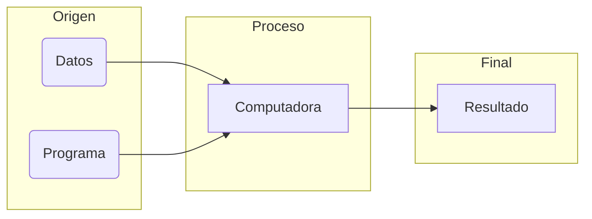
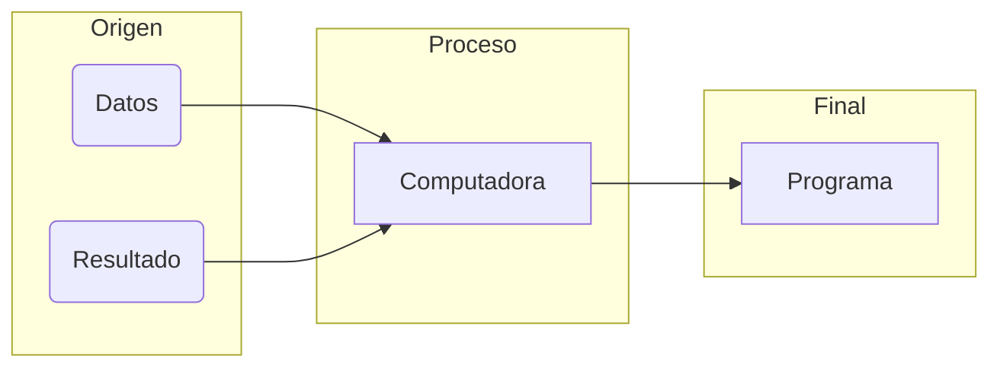

# 
APRENDIZAJE AUTOMÁTICO

<b>Profesor</b>: Jose Aguilar

## OBJETIVO
Estudiar aspectos avanzados en aprendizaje automático o aprendizaje de máquinas
 El cual es un subcampo de las ciencias de la computación, y subárea de la inteligencia artificial, cuyo objetivo es desarrollar técnicas que permitan que las computadoras aprendan
 > Cómo aprender, más concretamente, encontrar algoritmos para usar los datos para construir modelos capaces de generalizar comportamientos.

## PLAN DE CURSO
 **Unidad 1**: Introducción
 - Filosofía
 - Metodología a usar en el curso
 - Introducción al aprendizaje automático
 - Ingenieria de descriptores

 **Unidad 2**: Aprendizaje supervisado
 - Conceptualización
 - Aprendizaje para tareas de clasificación
 - Aprendizaje para tareas de predicción

 **Unidad 3**: Aprendizaje no supervisado
 - Conceptualización
 - Jerárquico
 - Basado en centroide
 - Basado en densidad
 - Basado en modelos

 **Unidad 4**: Aprendizaje por reforzamiento
 - Conceptualización
 - 
 - 

 **Unidad 5**: Aprendizaje avanzado
 - Aprendizaje híbrido
 - Aprendizaje evolutivo
 - Meta-aprendizaje

 **Adicionales**
 - Redes bayesianas
 - KNN
 - Basadas en descenso de gradientes
 - Redes neuronales 
 - etc

----
 Posibles obras ciéntificas
 1. Meta-aprendizaje automático
 2. Aprendizaje colectivo/federado
 3. Semi-supervised learning
 4. Online learning
 5. Collective intelligence

---
 Entre los sistemas hibridos inteligentes los que más se investigan en la actualidad sonl **lógica difusa**, **red neuronal** y **computación evolutiva**.

 ---
### Plantilla
| Informes técnicos  |Informes ciéntificos
| :------------ |:---------------
| Objetivo de la iteración| Introducción
| Contextualización del problema | Marco teórico del problema
| Diseño del modelo | Metodología de SLR
| Cuaderno Jupiter | Análisis de resultados
| Pruebas | Conclusiones
| Análisis de resultados

---
**Inteligencia**: capacidad de adquirir y usar conocimiento 
- Cómo el cerebro percibe, entiende, predice y manipula? 
    - Razonar, aprender, comunicar y actuar
 - Hacer programas que
    - razonen racionalmente
    - aprendan y descubran
    - jueguen
    - se comuniquen naturalmente con los humanos
- Universo:

| Razonamiento  | Visión artificial
| :------------ |:---------------
| Resolución de problemas mediante inferencia: deductiva, abductiva o inductiva| Comprender y analizar imágenes y videos 

| Aprendizaje automático  | 
| :------------ |:---------------
| Técnicas que permitan que las computadores aprendan a partir de los datos|

- Áreas
    - Inteligencia Artificial
        - Teoría de agentes
        - Sistemas multiagentes (IA distribuidas)
    - Técnicas inteligentes clásicas
        - Redes neuronales artificiales
        - Lógica difusa
        - Computación evolutiva
    - Técnicas inteligentes distribuidas
        - Algoritmos inspirados en colonias de insectos
        - Algoritmos inspirados en fenómenos físicos
        - Algoritmos inspirados en sistemas biológicos

---
*Aprendizaje*? "Sistema que aprende es aquel que recibe una señal de entrada y la ransforma en una salida de acuerdo con algún principio de auto-organización"

*Aprendizaje automático*? 
- Aplicación de IA en la que les damos a los programas acceso a datos históricos y les permitimos aprender por sí mismo desde ellos
- Es el estudio y la construcción de sistemas que pueden aprender de los datos
- "Computadores que aprenden sin ser programdos explícitamente"
- "Usar algoritmos para enteder patrones en datos"
- Construcción de modelos de conocimiento

*Programación tradicional*

*Programación en IA*

----
**Modelos de ML**

Descriptivo ==> Predictivo ==> Prescriptivo
Preguntas
    Qué paso?                       |Cómo es el modelo?
    Qué está pasando?               | Qué caracteriza a esos modelos?
    Cuál es el problema?            
    Qué acciones son necesarias?

==
Habilidades
    Reportes                        | Simulación
    Modelos de mejora               | Formulas matemáticas
    Simulación

==
Resultados
    Mejores en la organización      | Caracterización

----
**Ciencias de Datos** - Ingeniería de descriptores

Proceso 

- Recopilación de datos
- Detección de características
- Extracción de características
- Reducción y selección de características
- Selección del algoritmo y construcción del modelo

----
### 
ASIGNACIONES

1. Ingeniería de características
2. Trabajo obra ciéntifica

#### 1 : Ingeniería de características
> **Descripción** : selección ó extracción de características, y de acuerdo a esto definir pasos y documentar

#### 2 : Trabajo obra ciéntifica
> **Descripción** : seleccionar de un conjunto de opciones de obras ciéntificas una que se vaya a desarrollar a lo largo del curso para una entrega final de reporte.

*Opciones seleccionadas*

=> 1, 2, 3, 4, 5, 6, 7, 8, 9, 0, 1, 2 
O> 3, 1, 1, 1, 4, 5, 2, 3, 2, 4, 1, 1 
D> 3, 1, 3, 4, 4, 4, 1, 1, 5, 1, 1, 1 

1. Meta-aprendizaje automática <tt>3</tt>
2. Técnicas de ML para procesamiento de series temporales <tt>3.5</tt>
3. Técnicas de aprendizaje con datos con ruidos <tt>4</tt>
4. Técnicas de aprendizaje con desbalance de clases <tt>4.5</tt>

---
### 
APRENDIZAJE SUPERVISADO

El proceso de modelado se realiza sobre un conjunto de ejemplos formado por entradas al sistema y la respuesta que debería darse en el output.

A partir de un conjunto de **ejemplos de entrenamiento etiquetados** por expertos con la clase a la que pertenecen, los algoritmos deben generalizar con diferentes objetivos.

**Generación de modelo** 
Necesario definir un conjunto de datos de entrenamiento compuesto por objetos que ya tienen su clase asignada. El modelo es entonces creado analizando las relaciones entre los atributos de los objetos en el conjunto de entrenamiento y las clases. Se pretende que el conjunto de datos sea lo más "diversa" posible.

**Modelo de clasificación** 
Ante nuevos valores de unas **variables independientes** (input) el modelo obtenido me permite determinar la clase a la que pertenece (output). Los modelos de clasificación *suave* permiten además determinar el grado o pbb de certeza de cada una de las clasificaciones.

**Métricas de evaluación** 
Existen múltiples métricas y la elección de un conjunto particular de ellas depende del problema trabajado y el objetivo del modelo.

**Tipos de validación** 
Hay múltiples técnicas en que se particionan los datos para ejecutar las respectivas validaciones del rendimiento del modelo seleccionado.

**Representación de salidas** 
- Tablas de decisión : forma más simple y rudimentaria para representar la salida de una máquina de aprendizaje.

**
Árboles de decisión
** 
Parte de un conjunto de entrenamiento. Es consistente para cualquier conjunto de entrenamiento, cuando hay un camino a una hoja para cada uno de los miembros del conjunto. Está basado en tablas de verdad. Suelen ser empleados en tareas de clasificación, y también, aunque menos, en tareas de predicción.

**Construcción** tiene la idea de escoger el atributo *más significativo* como raíz del (sub)-árbol. El cómo es, **1.** si hay + y - ejemplos escoger atributo que mejor los divida (> discriminante), **2.** si hay participantes con + y -, buscar 2do atributo para seguir partiendo. Se debe elegir una *medida de partición*, como la entropía. Se completa hasta cumplir un cierto compromiso *cobertura* o *precisión*.

**Refinamiento** se puede ejecutar mediante, por ejemplo, el podaje del árbol.x

**Representación** reglas de clasificación. 

> Es importante mencionar que en varios casos un modelo estadístico frecuentista puede ser un buen proxy de base de evaluación de los modelos.

**
Random forest
** 
Conjunto de clasificadores que consta de muchos árboles de decisión y genera como salida la clase como una combinación de las clases de salidas de los árboles individuales.

**
Bagging & Boosting
** 

**
Redes neuronales artificiales
** 
Nueva forma de computación inspirada en el cerebro. Es un modelo matemático compuesto por un gran número de elementos de procesamiento, eventualmente en niveles. Son redes interconectadas masivamente en paralelo de elementos simples y organización diversa. 

**Forma de trabajo**
1. El conjunto de unidades de procesamiento
2. El estado interno o de activación de las neuronas
3. Las conexiones entre las neuronas
4. Las conexiones con el ambiente
5. La regla de propagación
6. La función de activación
7. La función de transición o de salida
8. La topología o arquitectura de la red
9. El algoritmo de aprendizaje

**Aprendizaje** 
Se basa en un proceso que permite que la red aprenda a comportarse según unos objetivos específicos.

**Algoritmo**
1. Presentación de las entradas
2. Cálculo de la salida actual
3. Adaptación de los pesos
--
1. Inicialización de los pesos y umbral
2. Fase de entrenamiento
    - Presentacipon de las entradas y salida deseada
    - Adaptación de los pesos
3. Fase de reconocimiento

**Corrección de error** : descenso gradiente, buscando reducir el error

**Perceptrón**

